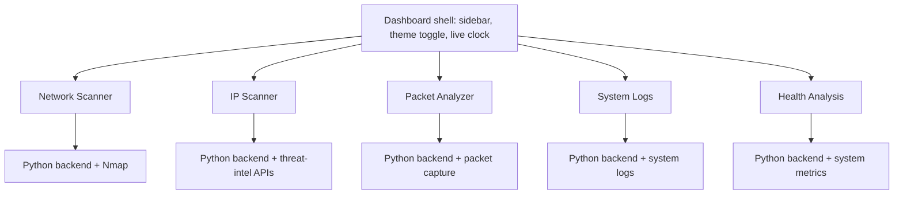

# NEXORA

### Security Command Center

A unified network analysis and SOC monitoring tool: scan, capture, investigate and monitor from one dashboard.

---

> **Note:** NEXORA is **not an open-source project**. This repository is a **showcase** that contains only screenshots of the application (dark and light themes) and this description. The source code is not published here.

## Table of Contents

- [About](#about)
- [Key Features](#key-features)
- [Application Tour](#application-tour)
  - [Dashboard](#1-dashboard)
  - [Network Scanner](#2-network-scanner)
  - [IP Scanner](#3-ip-scanner)
  - [Packet Analyzer](#4-packet-analyzer)
  - [System Logs](#5-system-logs)
  - [Health Analysis](#6-health-analysis)
- [How It Is Built](#how-it-is-built)
- [Planned Improvements](#planned-improvements)
- [Team](#team)
- [Disclaimer](#disclaimer)

---

## About

Security and network work is usually spread across many separate tools, each with its own interface, commands and output. **NEXORA** brings the everyday tasks of a Security Operations Center (SOC) into a single, consistent dashboard:

- see what is on your network,
- scan hosts with Nmap without memorising flags,
- check suspicious IPs, domains, URLs and files against three threat-intelligence sources,
- capture and filter live traffic,
- read live system logs with anomaly detection,
- and keep an eye on the health of the machine and of NEXORA itself.

The application runs on Ubuntu 24.04, shows live data from the host machine, and comes with a **dark** and a **light** theme.

---

## Key Features

- **One dashboard, six tabs:** Dashboard, Network Scanner, IP Scanner, Packet Analyzer, System Logs and Health Analysis.
- **Nmap command builder** with editable command line, sudo toggle and dynamic scan options.
- **Threat intelligence** from VirusTotal, AbuseIPDB and AlienVault OTX in one view.
- **Live packet capture** with Wireshark-style display filters, PCAP/PCAPNG import and save.
- **Live system logs** for Linux and Windows (VM) with rich filters and anomaly detection.
- **Health monitoring** of CPU, memory, disk, network I/O, services and the log pipeline.
- **Dark and light themes** with a consistent design across every page.

---

## Application Tour

The sidebar has six tabs. Each one is shown below in both themes.

### 1. Dashboard

A realtime overview of the device, the network and the hosts connected to it. This is the first place to look to see who is on the network.

| Dark | Light |
| :---: | :---: |
|  |  |

- **My Device:** hostname, IP address (for example `1.2.3.4`), MAC address, OS, CPU architecture and RAM.
- **Connected Network:** network name, connection status, gateway, subnet, DNS, interface, connection type and Wi-Fi signal strength.
- **Connected Devices:** searchable table with IP, MAC, hostname, vendor, device type, status and last-seen time.
- **Live Network Traffic:** live counters for packets, TCP, UDP, DNS and ICMP, a live packet list and a **Capture Packets** button.

### 2. Network Scanner

A flexible Nmap command builder, so you do not have to remember flags.

| Dark | Light |
| :---: | :---: |
|  |  |

- **Command Builder:** editable Nmap command with a **sudo** toggle, validity check, **Copy** and **Run**.
- **Targets:** target IP (for example `1.2.3.4`) and an optional port list such as `80,443`.
- **Scan Templates:** shows only the templates you create from your own custom commands.
- **Scan Options (Dynamic):** categories such as Target Specification, Host Discovery, Port Scanning, Port Specification, Service and Version, OS Detection, Scripting (NSE), Timing and Performance, Firewall / Evasion, and Spoofing and Decoys. Options that need root are marked **SUDO** (TCP SYN, ACK, Window, Maimon, Null, FIN, Xmas).
- **Top actions:** **Custom Commands** (opens the option help panel) and **Saved Scans**.
- **Results:** tabs for Results, Open Ports, Services, Host Info and Raw Output, with search, Import, Export and Clear.

### 3. IP Scanner

Check an IP address, domain, URL or file against three threat-intelligence sources at once. Useful for alert triage and for checking suspicious links.

| Dark | Light |
| :---: | :---: |
|  |  |

- **Input modes:** **IP / Domain / URL** and **File Scan**.
- **VirusTotal:** vendor detections, country, ASN and reputation.
- **AbuseIPDB:** abuse confidence score, total reports, country and ISP.
- **AlienVault OTX:** pulses, related URLs and related domains.
- **Threat Summary:** one table that combines the status and indicator from every source.
- **Recent Abuse Reports:** reporter, country, comment and date.
- **Convenience:** example inputs, recent inputs with one-click re-check, **Clear All**, **View Full Report** and **Copy Input** buttons.
- **API keys:** keys are entered at the top of the page and stored with **Save Keys**, with an optional **Password** lock.

### 4. Packet Analyzer

Live traffic capture and inspection in the style of Wireshark.

| Dark | Light |
| :---: | :---: |
|  |  |

- **Capture Controls:** Start Capture, Stop Capture, Resume, Save (PCAP), Cancel, interface selector and **Import PCAP / PCAPNG**.
- **Custom Templates:** save your own display-filter templates.
- **Display Filter:** Wireshark-style filters, for example `ip.addr eq 1.2.3.4 && tcp.flags eq syn`.
- **Protocol Distribution:** donut chart of TCP, ARP, ICMP, UDP, TLS, DNS and HTTP share.
- **Top Talkers (IP):** the busiest addresses by packet count.
- **Captured Packets (Live):** table with number, time, source, destination, protocol, length and info, plus quick filters (All, TCP, UDP, HTTP, DNS, TLS, ICMP, ARP, Other) and search.

### 5. System Logs

Live system events from the host and from a Windows VM, with filters and anomaly detection. A good starting point for investigations.

| Dark | Light |
| :---: | :---: |
|  |  |

- **Summary counters:** Total Events, Critical, Error, Warning, Info and Debug.
- **Device type switch:** **Auto Detect**, **Windows** or **Linux** (Linux is the host machine, Windows runs in a VM); the UI and logs follow the selection.
- **Controls:** Live, Stop and **Analyze Log File**.
- **Filters:** time range, OS, host, log source, event type, level, user, process, source IP, destination IP and keyword, plus quick filters (All Logs, Authentication, Process, File Changes, Network, System, Security, Errors, Warnings, Critical).
- **Log table:** column picker (including Host), Export, full-screen view and per-row actions.
- **Event Details:** stays empty until a row is clicked.
- **Side panels:** Log Level Distribution, Top Log Sources and Threat / Anomaly Detection.

### 6. Health Analysis

Is the machine, and NEXORA itself, healthy? This tab appears as `Health_Analysis` in the sidebar.

| Dark | Light |
| :---: | :---: |
|  |  |

- **Status banner:** "All Systems Operational" at a glance.
- **Resource cards:** CPU, memory, disk and network I/O, each with a live mini-chart.
- **NEXORA Services:** Dashboard, Network Scanner, IP Scanner, Packet Analyzer, System Logs and System Health, each with status, uptime and last check.
- **Log Pipeline:** events per second, events processed, queue and failed events.
- **Network Details**, **System Information** (hostname, OS, kernel, Python, uptime, NEXORA version, backend port) and **Resource Trends** charts.

---

## How It Is Built

NEXORA is modular. A main dashboard shell holds the sidebar, header, theme toggle and live clock, and loads every tab as its own page. Each tab has its own Python backend running on its own port, so a problem in one module does not bring down the others, and new modules can be added by registering another page.

**Stack:** HTML, CSS and JavaScript front end, Python backends, Nmap, VirusTotal / AbuseIPDB / AlienVault OTX APIs, on Ubuntu 24.04.

---

## Planned Improvements

- Tune anomaly rules to reduce false positives.
- Mask and securely store API keys in the IP Scanner.
- Alerting (email or messaging) and report export (PDF / CSV).
- Windows VM log ingestion, multi-host agents and SIEM export (for example Splunk).

---

## Disclaimer

NEXORA is built for education, lab practice and authorised security work. Scanning and capture features are meant to be used only on networks and systems that you own or have explicit permission to test.